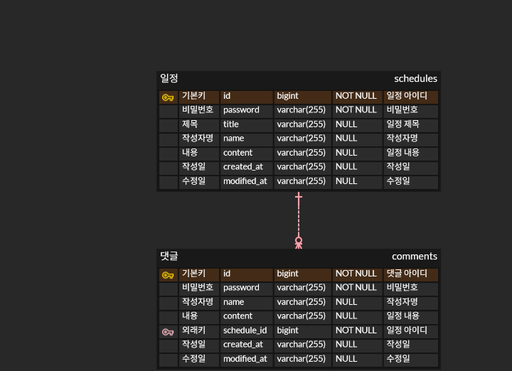

# 📘 API 명세서

> 이 문서는 프로젝트에서 제공하는 API를 명확하고 일관된 형식으로 정의하기 위한 **API 명세서**입니다.
> 모든 API는 JSON 형식으로 요청(Request) 및 응답(Response)을 주고받습니다.

---

## 🧩 공통 사항

### Base URL
```
https://localhost:8080
```

### Content-Type
```
Content-Type: application/json
```

### 공통 응답 코드
| HTTP Status | 설명    |
|-----|-------|
| 200 | 요청 성공 |
| 201 | 리소스 생성 성공 |
| 204 | 삭제 성공 |
| 400 | 잘못된 요청 (Validation 오류) |
| 404 | 리소스 없음 |
| 500 | 서버 내부 오류 |

---

## 📌 API 목록

| API 이름 | Method | URL        | 설명    |
|-------|------|------------|-------|
| 일정 생성 | POST | /schedules | 일정 생성 |
| 선택 일정 조회 | GET  | /schedules/{id} | 일정 단건 조회 |
| 전체 일정 조회 | GET  | /schedules | 전체 일정 조회 |
| 일정 수정 | PUT  | /schedules/{id} | 선택한 일정 수정 |
| 일정 삭제 | DELETE | /schedules/{id} | 선택한 일정 삭제 |
| 댓글 생성 | POST | /schedules/{scheduleId}/comments | 댓글 생성 |

---

## 1️⃣ 일정 생성 API

### 🔹 API 정보
- **API 명**: 일정 생성
- **Method**: `POST`
- **URL**: `/schedules`

### 🔹 Request Example
```json
{
  "title": "오늘의 일정",
  "content": "헬스 PT 8시",
  "name": "홍길동",
  "password": "password123"
}
```

### 🔹 Response Example (201 Created)
```json
{
  "id": 1,
  "title": "오늘의 일정",
  "content": "헬스 PT 8시",
  "name": "홍길동",
  "createdAt": "2026-01-30T20:26:01.5576386",
  "modifiedAt": "2026-01-30T20:26:01.5576386"
}
```

---

## 2️⃣ 사용자 생성 API

### 🔹 API 정보
- **API 명**: 선택 일정 조회
- **Method**: `GET`
- **URL**: `/schedules/{id}`

### 🔹 Path Parameter
| 이름 | 타입 | 필수 | 설명    |
|----|----|----|-------|
| id | Long | O | 일정 ID |

### 🔹 Response Example (200 OK)
```json
{
  "id": 1,
  "title": "오늘의 일정",
  "content": "헬스 PT 8시",
  "name": "홍길동",
  "createdAt": "2026-01-30T20:26:01.5576386",
  "modifiedAt": "2026-01-30T20:26:01.5576386",
  "comments": []
}
```

---

## 2️⃣ 사용자 생성 API

### 🔹 API 정보
- **API 명**: 전체 일정 조회
- **Method**: `GET`
- **URL**: `/schedules`

### 🔹 Response Example (200 OK)
```json
[
  {
    "id": 2,
    "title": "오늘의 일정2",
    "content": "공휴일",
    "name": "김모씨",
    "createdAt": "2026-01-30T20:31:24.547735",
    "modifiedAt": "2026-01-30T20:31:24.547735"
  },
  {
    "id": 1,
    "title": "오늘의 일정",
    "content": "헬스 PT 8시",
    "name": "홍길동",
    "createdAt": "2026-01-30T20:26:01.557639",
    "modifiedAt": "2026-01-30T20:26:01.557639"
  }
]
```

---

## 🧪 테스트 및 문서화 도구

- **Postman**: API 테스트 및 문서 자동화
    - https://learning.postman.com/docs/publishing-your-api/api-documentation-overview/

---

## 📎 참고 사항
- 모든 날짜/시간 데이터는 `ISO-8601` 형식을 사용합니다.
- Enum 값은 대문자 문자열로 반환합니다.
- 에러 응답은 공통 포맷을 유지합니다.

```json
{
  "code": "ERROR_CODE",
  "message": "에러 메시지"
}
```

---
# 📘 ERD


