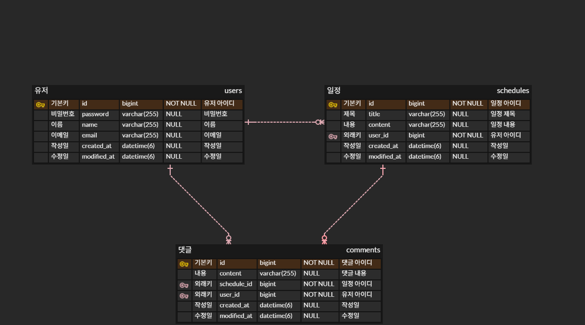

# 📘 API 명세서

> 이 문서는 프로젝트에서 제공하는 API를 명확하고 일관된 형식으로 정의하기 위한 **API 명세서**입니다.
> 모든 API는 JSON 형식으로 요청(Request) 및 응답(Response)을 주고받습니다.

---

## 🧩 공통 사항

### Base URL
```
https://localhost:8080
```

### Content-Type
```
Content-Type: application/json
```

### 공통 응답 코드
| HTTP Status | 설명    |
|-----|-------|
| 200 | 요청 성공 |
| 201 | 리소스 생성 성공 |
| 204 | 삭제 성공 |
| 400 | 잘못된 요청 (Validation 오류) |
| 404 | 리소스 없음 |
| 500 | 서버 내부 오류 |

---

## 📌 API 목록

| API 이름 | Method | URL     | 설명     |
|------|------|---------|--------|
| 회원가입 | POST | /signup | 유저 생성  |
| 로그인  | POST | /login  | 유저 로그인 |
| 유저 단건 조회 | GET  | /users/me | 로그인한 유저 정보 조회 |
| 유저 전체 조회 | GET  | /users  | 모든 유저 조회 |
| 유저 수정 | PUT  | /users/me | 로그인한 유저 정보 수정 |
| 유저 삭제 | DELETE  | /users/me | 로그인한 유저 삭제 |

| API 이름    | Method | URL       | 설명            |
|-----------|-----|-----------|---------------|
| 일정 생성     | POST | /schedules | 일정 생성         |
| 선택 일정 조회  | GET | /schedules/{id} | 일정 단건 조회      |
| 전체 일정 조회  | GET | /schedules | 전체 일정 조회      |
| 일정 수정     | PUT | /schedules/{id} | 선택한 본인 일정 수정  |
| 일정 삭제     | DELETE | /schedules/{id} | 선택한 본인 일정 삭제  |
| 일정 페이징 조회 | GET | /schedules/paging | 페이징된 전체 일정 조회 |

| API 이름   | Method | URL       | 설명    |
|----------|-----|-----------|-------|
| 댓글 생성    | POST | /schedules/{scheduleId}/comments | 댓글 생성 |
| 댓글 전체 조회 | GET | /comments | 유저별 댓글 전체 조회 |

---

## 1️⃣ 회원가입 API

### 🔹 API 정보
- **API 명**: 회원가입
- **Method**: `POST`
- **URL**: `/signup`

### 🔹 Request Example
```json
{
  "name":"김삿갓",
  "email":"kim@gmail.com",
  "password":"43214321"
}
```

### 🔹 Response Example (201 Created)
```json
{
  "id": 1,
  "name": "김삿갓",
  "email": "kim@gmail.com",
  "createdAt": "2026-02-10T10:17:32.1350535",
  "modifiedAt": "2026-02-10T10:17:32.1350535"
}
```

---

## 2️⃣ 로그인 API

### 🔹 API 정보
- **API 명**: 로그인
- **Method**: `POST`
- **URL**: `/login`
- **설명**: 로그인 성공 시 서버는 세션을 생성하고 JSESSIONID 쿠키를 통해 인증 상태를 유지한다

### 🔹 Request Example
```json
{
  "email": "kim@gmail.com",
  "password": "43214321"
}
```

### 🔹 Response Example (200 OK)
```json

```

---

## 3️⃣ 유저 단건 조회 API

### 🔹 API 정보
- **API 명**: 유저 단건 조회
- **Method**: `GET`
- **URL**: `/users/me`

### 🔹 Response Example (200 OK)
```json
{
    "id": 1,
    "name": "김삿갓",
    "email": "kim@gmail.com",
    "createdAt": "2026-02-10T10:17:32.135054",
    "modifiedAt": "2026-02-10T10:17:32.135054"
}
```

---

## 4️⃣ 유저 전체 조회 API

### 🔹 API 정보
- **API 명**: 유저 전체 조회
- **Method**: `GET`
- **URL**: `/users`

### 🔹 Response Example (200 OK)
```json
[
  {
    "id": 1,
    "name": "김삿갓",
    "email": "kim@gmail.com",
    "createdAt": "2026-02-10T10:17:32.135054",
    "modifiedAt": "2026-02-10T10:17:32.135054"
  },
  {
    "id": 2,
    "name": "홍길동",
    "email": "hong@gmail.com",
    "createdAt": "2026-02-10T10:22:07.019531",
    "modifiedAt": "2026-02-10T10:22:07.019531"
  }
]
```

---

## 5️⃣ 유저 수정 API

### 🔹 API 정보
- **API 명**: 유저 수정
- **Method**: `PUT`
- **URL**: `/users/me`

### 🔹 Request Example
```json
{
    "name":"김삿갓",
    "email":"satgat@gmail.com",
    "password":"12121212"
}
```

### 🔹 Response Example (200 OK)
```json
{
  "id": 1,
  "name": "김삿갓",
  "email": "satgat@gmail.com",
  "createdAt": "2026-02-10T10:17:32.135054",
  "modifiedAt": "2026-02-10T10:17:32.135054"
}
```

---

## 6️⃣ 유저 삭제 API

### 🔹 API 정보
- **API 명**: 유저 삭제
- **Method**: `DELETE`
- **URL**: `/users/me`

### 🔹 Response Example (204 No Content)
```json

```

---

## 1️⃣ 일정 생성 API

### 🔹 API 정보
- **API 명**: 일정 생성
- **Method**: `POST`
- **URL**: `/schedules`

### 🔹 Request Example
```json
{
  "title": "나의 하루3",
  "content": "점심 약속 11시"
}
```

### 🔹 Response Example (201 Created)
```json
{
  "id": 3,
  "title": "나의 하루3",
  "content": "점심 약속 11시",
  "name": "홍길동",
  "createdAt": "2026-02-10T10:48:00.9219948",
  "modifiedAt": "2026-02-10T10:48:00.9219948"
}
```

---

## 2️⃣ 일정 조회 (선택 일정 조회) API

### 🔹 API 정보
- **API 명**: 선택 일정 조회
- **Method**: `GET`
- **URL**: `/schedules/{id}`

### 🔹 Path Variable
| 이름 | 타입 | 필수 | 설명    |
|----|----|----|-------|
| id | Long | O | 일정 ID |

### 🔹 Response Example (200 OK)
```json
{
  "id": 1,
  "title": "나의 하루",
  "content": "점심 약속 12시",
  "name": "홍길동",
  "createdAt": "2026-02-10T10:35:50.389632",
  "modifiedAt": "2026-02-10T10:35:50.389632",
  "comments": [
    {
      "id": 1,
      "content": "댓글1",
      "name": "홍길동",
      "createdAt": "2026-02-10T10:39:11.003731",
      "modifiedAt": "2026-02-10T10:39:11.003731"
    },
    {
      "id": 2,
      "content": "댓글2",
      "name": "홍길동",
      "createdAt": "2026-02-10T10:40:10.256678",
      "modifiedAt": "2026-02-10T10:40:10.256678"
    }
  ]
}
```

---

## 3️⃣ 일정 조회 (전체 일정 조회) API

### 🔹 API 정보
- **API 명**: 전체 일정 조회
- **Method**: `GET`
- **URL**: `/schedules`

### 🔹 Response Example (200 OK)
```json
[
  {
    "id": 2,
    "title": "나의 하루2",
    "content": "점심 약속 11시",
    "name": "홍길동",
    "createdAt": "2026-02-10T10:35:57.30031",
    "modifiedAt": "2026-02-10T10:35:57.30031"
  },
  {
    "id": 1,
    "title": "나의 하루",
    "content": "점심 약속 12시",
    "name": "홍길동",
    "createdAt": "2026-02-10T10:35:50.389632",
    "modifiedAt": "2026-02-10T10:35:50.389632"
  }
]
```

---

## 4️⃣ 일정 수정 API

### 🔹 API 정보
- **API 명**: 일정 수정
- **Method**: `PUT`
- **URL**: `/schedules/{id}`

### 🔹 Path Variable
| 이름 | 타입 | 필수 | 설명    |
|----|----|----|-------|
| id | Long | O | 일정 ID |

### 🔹 Request Example
```json
{
  "title":"오늘의 일정2",
  "content":"수정한 내용"
}
```

### 🔹 Response Example (200 OK)
```json
{
  "id": 1,
  "title": "오늘의 일정2",
  "content": "수정한 내용",
  "name": "홍길동",
  "createdAt": "2026-02-10T10:35:50.389632",
  "modifiedAt": "2026-02-10T10:35:50.389632"
}
```

---

## 5️⃣ 일정 삭제 API

### 🔹 API 정보
- **API 명**: 일정 삭제
- **Method**: `DELETE`
- **URL**: `/schedules/{id}`

### 🔹 Path Variable
| 이름 | 타입 | 필수 | 설명    |
|----|----|----|-------|
| id | Long | O | 일정 ID |

### 🔹 Response Example (204 No Content)
```json

```

---

## 6️⃣ 일정 페이징 조회 API

### 🔹 API 정보
- **API 명**: 유저별 페이징된 전체 일정 조회
- **Method**: `GET`
- **URL**: `/schedules/paging`

### 🔹 Query Parameter
| 이름   | 타입  | 필수 | 설명 | 디폴트 값 |
|------|-----|---|----|----|
| page | int | X | 페이지 번호 | 0  |
| size | int | X | 페이지 크기 | 10 |

### 🔹 Response Example (204 No Content)
```json
{
  "content": [
    {
      "id": 2,
      "title": "나의 하루2",
      "content": "점심 약속 11시",
      "commentCount": 0,
      "name": "홍길동",
      "createdAt": "2026-02-10T10:35:57.30031",
      "modifiedAt": "2026-02-10T10:35:57.30031"
    },
    {
      "id": 1,
      "title": "나의 하루",
      "content": "점심 약속 12시",
      "commentCount": 0,
      "name": "홍길동",
      "createdAt": "2026-02-10T10:35:50.389632",
      "modifiedAt": "2026-02-10T10:35:50.389632"
    }
  ],
  "empty": false,
  "first": true,
  "last": true,
  "number": 0,
  "numberOfElements": 2,
  "pageable": {
    "offset": 0,
    "pageNumber": 0,
    "pageSize": 10,
    "paged": true,
    "sort": {
      "empty": false,
      "sorted": true,
      "unsorted": false
    },
    "unpaged": false
  },
  "size": 10,
  "sort": {
    "empty": false,
    "sorted": true,
    "unsorted": false
  },
  "totalElements": 2,
  "totalPages": 1
}
```

---

## 1️⃣ 댓글 생성 API

### 🔹 API 정보
- **API 명**: 댓글 생성
- **Method**: `POST`
- **URL**: `/schedules/{scheduleId}/comments`

### 🔹 Path Variable
| 이름 | 타입 | 필수 | 설명    |
|----|----|----|-------|
| scheduleId | Long | O | 일정 ID |

### 🔹 Request Example
```json
{
  "content":"댓글3"
}
```

### 🔹 Response Example (201 Created)
```json
{
  "id": 3,
  "content": "댓글3",
  "name": "홍길동",
  "createdAt": "2026-02-10T10:52:20.5170414",
  "modifiedAt": "2026-02-10T10:52:20.5170414"
}
```

---

## 2️⃣ 댓글 전체 조회 API

### 🔹 API 정보
- **API 명**: 유저별 댓글 전체 조회
- **Method**: `GET`
- **URL**: `/comments`

### 🔹 Response Example (200 OK)
```json
[
  {
    "id": 2,
    "content": "댓글2",
    "name": "홍길동",
    "createdAt": "2026-02-10T10:40:10.256678",
    "modifiedAt": "2026-02-10T10:40:10.256678"
  },
  {
    "id": 1,
    "content": "댓글1",
    "name": "홍길동",
    "createdAt": "2026-02-10T10:39:11.003731",
    "modifiedAt": "2026-02-10T10:39:11.003731"
  }
]
```

---

## 🧪 테스트 및 문서화 도구

- **Postman**: API 테스트 및 문서 자동화
    - https://learning.postman.com/docs/publishing-your-api/api-documentation-overview/

---

## 📎 데이터베이스 설정 및 참고 사항

### 🗄️ Database 정보
- DBMS: MySQL
- Database Name: schedule
- Username: root
- Password: 12345678

<br>

### 🛢️ 테이블 구성

| 테이블명      | 설명              |
|-----------|-----------------|
| users     | 유저 정보를 저장하는 테이블 |
| schedules | 일정 정보를 저장하는 테이블 |
| comments  | 일정에 종속된 댓글 정보를 저장하는 테이블 |

<br>

### 📋 ERD



---

## 🧪 테스트 및 작성 도구

- **ERD Cloud**: ERD 무료 생성 Tool
  - https://www.erdcloud.com/

---