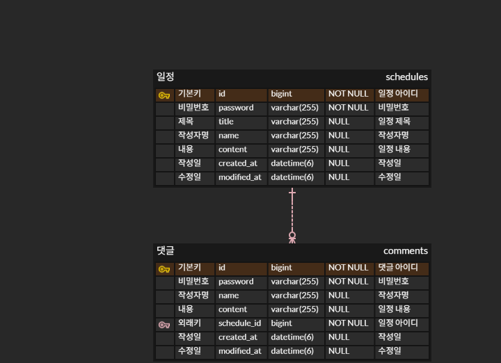

# 📘 API 명세서

> 이 문서는 프로젝트에서 제공하는 API를 명확하고 일관된 형식으로 정의하기 위한 **API 명세서**입니다.
> 모든 API는 JSON 형식으로 요청(Request) 및 응답(Response)을 주고받습니다.

---

## 🧩 공통 사항

### Base URL
```
https://localhost:8080
```

### Content-Type
```
Content-Type: application/json
```

### 공통 응답 코드
| HTTP Status | 설명    |
|-----|-------|
| 200 | 요청 성공 |
| 201 | 리소스 생성 성공 |
| 204 | 삭제 성공 |
| 400 | 잘못된 요청 (Validation 오류) |
| 404 | 리소스 없음 |
| 500 | 서버 내부 오류 |

---

## 📌 API 목록

| API 이름 | Method | URL        | 설명    |
|-------|------|------------|-------|
| 일정 생성 | POST | /schedules | 일정 생성 |
| 선택 일정 조회 | GET  | /schedules/{id} | 일정 단건 조회 |
| 전체 일정 조회 | GET  | /schedules | 전체 일정 조회 |
| 일정 수정 | PUT  | /schedules/{id} | 선택한 일정 수정 |
| 일정 삭제 | DELETE | /schedules/{id} | 선택한 일정 삭제 |
| 댓글 생성 | POST | /schedules/{scheduleId}/comments | 댓글 생성 |

---

## 1️⃣ 일정 생성 API

### 🔹 API 정보
- **API 명**: 일정 생성
- **Method**: `POST`
- **URL**: `/schedules`

### 🔹 Request Example
```json
{
  "title": "오늘의 일정",
  "content": "헬스 PT 8시",
  "name": "홍길동",
  "password": "password123"
}
```

### 🔹 Response Example (201 Created)
```json
{
  "id": 1,
  "title": "오늘의 일정",
  "content": "헬스 PT 8시",
  "name": "홍길동",
  "createdAt": "2026-01-30T20:26:01.5576386",
  "modifiedAt": "2026-01-30T20:26:01.5576386"
}
```

---

## 2️⃣ 일정 조회 (선택 일정 조회) API

### 🔹 API 정보
- **API 명**: 선택 일정 조회
- **Method**: `GET`
- **URL**: `/schedules/{id}`

### 🔹 Path Variable
| 이름 | 타입 | 필수 | 설명    |
|----|----|----|-------|
| id | Long | O | 일정 ID |

### 🔹 Response Example (200 OK)
```json
{
  "id": 2,
  "title": "오늘의 일정2",
  "content": "공휴일",
  "name": "김모씨",
  "createdAt": "2026-01-31T14:27:17.430227",
  "modifiedAt": "2026-01-31T14:27:17.430227",
  "comments": [
    {
      "id": 1,
      "content": "댓글1",
      "name": "김모씨",
      "createdAt": "2026-01-31T14:46:09.384358",
      "modifiedAt": "2026-01-31T14:46:09.384358"
    }
  ]
}
```

---

## 3️⃣ 일정 조회 (전체 일정 조회) API

### 🔹 API 정보
- **API 명**: 전체 일정 조회
- **Method**: `GET`
- **URL**: `/schedules`

### 🔹 Query Parameter
| 이름 | 타입 | 필수 | 설명  |
|----|----|---|-----|
| name | String | X | 작성자명 |

### 🔹 Response Example (200 OK)
```json
[
  {
    "id": 2,
    "title": "오늘의 일정2",
    "content": "공휴일",
    "name": "김모씨",
    "createdAt": "2026-01-30T20:31:24.547735",
    "modifiedAt": "2026-01-30T20:31:24.547735"
  },
  {
    "id": 1,
    "title": "오늘의 일정",
    "content": "헬스 PT 8시",
    "name": "홍길동",
    "createdAt": "2026-01-30T20:26:01.557639",
    "modifiedAt": "2026-01-30T20:26:01.557639"
  }
]
```

---

## 4️⃣ 일정 수정 API

### 🔹 API 정보
- **API 명**: 일정 수정
- **Method**: `PUT`
- **URL**: `/schedules/{id}`

### 🔹 Path Variable
| 이름 | 타입 | 필수 | 설명    |
|----|----|----|-------|
| id | Long | O | 일정 ID |

### 🔹 Request Example
```json
{
  "title":"오늘의 일정3",
  "name":"김길동",
  "password":"password123"
}
```

### 🔹 Response Example (200 OK)
```json
{
  "id": 1,
  "title": "오늘의 일정3",
  "content": "헬스 PT 8시",
  "name": "김길동",
  "createdAt": "2026-01-31T14:26:11.838603",
  "modifiedAt": "2026-01-31T14:26:11.838603"
}
```

---

## 5️⃣ 일정 삭제 API

### 🔹 API 정보
- **API 명**: 일정 삭제
- **Method**: `DELETE`
- **URL**: `/schedules/{id}`

### 🔹 Path Variable
| 이름 | 타입 | 필수 | 설명    |
|----|----|----|-------|
| id | Long | O | 일정 ID |

### 🔹 Request Example
```json
{
  "password":"password123"
}
```

### 🔹 Response Example (204 No Content)
```json

```

---

## 6️⃣ 댓글 생성 API

### 🔹 API 정보
- **API 명**: 댓글 생성
- **Method**: `POST`
- **URL**: `/schedules/{scheduleId}/comments`

### 🔹 Path Variable
| 이름 | 타입 | 필수 | 설명    |
|----|----|----|-------|
| scheduleId | Long | O | 일정 ID |

### 🔹 Request Example
```json
{
  "content":"댓글1",
  "name":"김모씨",
  "password":"1111"
}
```

### 🔹 Response Example (201 Created)
```json
{
  "id": 1,
  "content": "댓글1",
  "name": "김모씨",
  "createdAt": "2026-01-31T14:46:09.3843582",
  "modifiedAt": "2026-01-31T14:46:09.3843582"
}
```

---

## 🧪 테스트 및 문서화 도구

- **Postman**: API 테스트 및 문서 자동화
    - https://learning.postman.com/docs/publishing-your-api/api-documentation-overview/

---

## 📎 데이터베이스 설정 및 참고 사항

### 🗄️ Database 정보
- DBMS: MySQL
- Database Name: schedule
- Username: root
- Password: 12345678

<br>

### 🛢️ 테이블 구성

| 테이블명      | 설명    |
|-----------|-------|
| schedules | 일정 정보를 저장하는 테이블 |
| comments  | 일정에 종속된 댓글 정보를 저장하는 테이블 |

<br>

### 📋 ERD



---

## 🧪 테스트 및 작성 도구

- **ERD Cloud**: ERD 무료 생성 Tool
  - https://www.erdcloud.com/

---